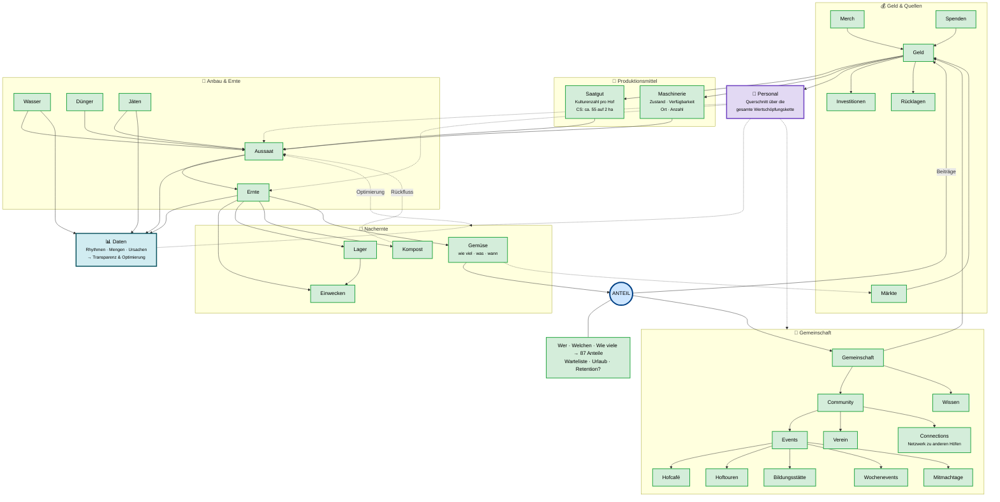
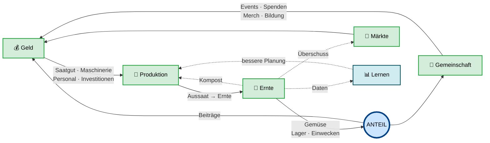
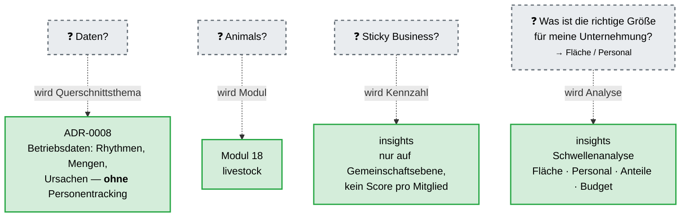

# Die Handskizze als Mermaid-Diagramm

Rekonstruktion von `uploads/IMG_9988.jpeg` (lesbar: `uploads/mm_rot.jpg`).

**Stand: alle Unsicherheiten geklärt** (Rückmeldung vom 25.07.2026, siehe §4).
Die Diagramme unten bilden die korrigierte Fassung ab.

---

## 1. Gesamtbild

---

## 2. Der Kreislauf, freigelegt

Dasselbe ohne Details — das ist die eigentliche Aussage der Skizze:

**Zwei große Kreise, ein Knoten.** Produktionskreis (Geld → Anbau → Ernte → Anteil →
Beiträge → Geld) und Gemeinschaftskreis (Anteil → Gemeinschaft → Events/Spenden/Merch →
Geld). Dazu drei kleine Rückflüsse: **Kompost** in die Produktion, **Märkte** für
Überschuss, und **Daten** als Lernschleife.

---

## 3. Die offenen Fragen der Skizze — und wo sie gelandet sind

---

## 4. Geklärte Lesungen

| # | Stelle | Klärung | Folge |
|---|---|---|---|
| 1 | Wort links von „Geld" | **Merch** — bestätigt | Merch bleibt Einnahmeposten in `finance-model`. **Aber:** Märkte sind trotzdem relevant, weil manche Solawis auf Märkten verkaufen → **neues Modul 21 `markets`** |
| 2 | „ca. 55 Kulturen" | Richtig, gilt für crowd salat auf 2 ha — **aber pro Hof frei** | Keine Annahme im Modell. Kulturenzahl ist Betriebsdatum, keine Konstante |
| 3 | „87" | **87 Anteile** (aktueller Stand CS) | Bestätigt das gewichtete Anteilsmodell aus ADR-0005 |
| 4 | Investitionen ↔ Geld | **Beide Richtungen**: Geld → Investitionen *und* zurück | Pfeil korrigiert |
| 5 | Personal | **Querschnitt über die gesamte Wertschöpfungskette**, nicht ein Schritt | Als eigener Querschnittsknoten dargestellt (violett) |
| 6 | „Daten" | **Betriebsdaten zur Transparenz und Optimierung** — siehe unten | Eigene ADR-0008, Erweiterung von `tasks` und `insights` |
| 7 | „Connections" | **Netzwerk zu anderen Höfen** | Gehört zu `knowledge` / `governance` |
| 8 | Lager ↔ Einwecken | **Beides**: direkt von der Ernte *und* aus dem Lager | Beide Pfeile bleiben |

---

## 5. Zu Punkt 6: was „Daten" wirklich bedeutet

Die Erläuterung dazu war die inhaltsreichste Rückmeldung und verdient eine eigene
Zusammenfassung, weil sie ein Querschnittsthema beschreibt, kein Modul.

**Gemeint ist:** welche Daten wären interessant zu sammeln, um daraus Erkenntnisse zu
gewinnen — innerhalb einer Saison und über Jahre hinweg.

Beispiele aus der Rückmeldung:

- In welchem **Rhythmus** wird ein Beet gejätet, gewässert, geerntet?
- **Wie viel** wird geerntet — und warum mal mehr, mal weniger, mal schneller, mal langsamer?
- **Arbeitsreihenfolge im Raum**: ein Beet mulchen oder jäten, während direkt daneben
  gepflanzt werden soll, ist unklug — erst alles andere erledigen, dann pflanzen, weil
  man dann noch frei rangieren kann.

**Ausdrücklich nicht gemeint:** Tracking von Mitarbeitenden. Es geht um Transparenz,
Best Practices und Optimierung.

Diese Abgrenzung ist heikel genug für eine eigene Entscheidung:
[**ADR-0008 — Betriebsdaten ohne Personentracking**](adr/0008-betriebsdaten-ohne-personentracking.md).

Das dritte Beispiel ist besonders interessant, weil es kein Auswertungs-, sondern ein
**Planungsproblem** ist: Aufgaben haben eine räumliche und zeitliche Ordnung, und die
richtige Reihenfolge spart real Arbeit. Das wird als **Reihenfolge-Assistent** in `tasks`
aufgenommen (Modulkatalog Nr. 5).
